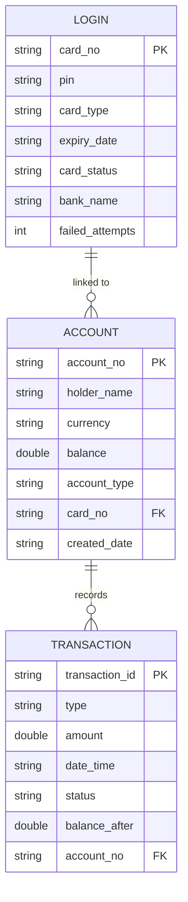

# ATM Simulation System

A console-based ATM Simulation application developed in **Java** demonstrating core **Object-Oriented Programming (OOP)** principles and relational database design.

---

## 📌 Project Overview

This project simulates real-world Automated Teller Machine (ATM) operations such as card authentication, balance inquiry, cash withdrawal, cash deposit, mini-statement generation, and PIN management. It also includes an SQL database schema (`atm_simulation.sql`) mapping the core entities and their relationships.

---

## ✨ Features

- **Card Authentication & Security**:
  - Secure 4-digit PIN verification.
  - Automatic card blocking mechanism after 3 consecutive failed PIN attempts.
- **Account Operations**:
  - **Balance Enquiry**: Check real-time account balance with currency details.
  - **Cash Deposit**: Deposit money into account with balance validation.
  - **Cash Withdrawal**: Withdraw funds with immediate balance deduction and insufficient funds protection.
  - **Mini Statement**: View chronological audit history of recent transactions.
  - **PIN Change**: Securely change existing PIN with verification.

---

## 🧱 Entity & Database Design

The project models three core entities representing a relational banking system:



### Entity Classes
1. **`Login`**: Represents the ATM card, PIN, issuer bank, and card status (`ACTIVE` / `BLOCKED`).
2. **`Account`**: Represents the customer's bank account linked to their card, holding balance and account type.
3. **`Transaction`**: Represents individual transaction records (Type, Amount, Date & Time, Status, and Balance After).

---

## 📂 Project Structure

```text
ATMSimulation/
├── src/
│   ├── com/
│   │   ├── erdiagrams/atm/
│   │   │   ├── Account.java             # Account entity model
│   │   │   ├── AtmService.java          # Business logic & banking operations
│   │   │   ├── AtmSimulationMain.java   # Main interactive console application
│   │   │   ├── Login.java               # Card & login authentication model
│   │   │   └── Transaction.java         # Transaction record model
│   │   │
│   │   └── java/project/
│   │       ├── Account.java             # Standalone account class
│   │       ├── Login.java               # Basic login handler
│   │       ├── Main.java                # Basic ATM runner
│   │       ├── MiniStatement.java       # Mini statement display helper
│   │       ├── PinChange.java           # PIN change logic
│   │       └── Transaction.java         # Basic transaction model
│   │
│   └── module-info.java
│
├── atm_simulation.sql                   # SQL queries for table creation & sample data
└── README.md                            # Project documentation
```

---

## 🗄️ Database Setup (`atm_simulation.sql`)

The repository includes a ready-to-use SQL file: [`atm_simulation.sql`](atm_simulation.sql).

### Steps to Run SQL:
1. Open your MySQL client (MySQL Workbench, phpMyAdmin, or Command Line).
2. Execute the script:
   ```sql
   SOURCE path/to/atm_simulation.sql;
   ```
   Or from terminal:
   ```bash
   mysql -u root -p < atm_simulation.sql
   ```

---

## 🚀 How to Run the Java Application

### Prerequisites
- **Java Development Kit (JDK 8 or higher)** installed.
- Eclipse IDE, IntelliJ IDEA, VS Code, or command-line terminal.

### Command Line Execution:

1. **Navigate to the project root:**
   ```bash
   cd "b:/codegnan/OOPS Programs/ATMSimulation"
   ```

2. **Compile the source files:**
   ```bash
   javac -d bin src/com/erdiagrams/atm/*.java
   ```

3. **Run the ATM Simulation:**
   ```bash
   java -cp bin com.erdiagrams.atm.AtmSimulationMain
   ```

---

## 🔑 Demo Credentials

To test the application immediately, use the pre-configured credentials:

| Field | Demo Value |
| :--- | :--- |
| **Card Number** | `1234567890123456` |
| **PIN** | `1234` |
| **Account No** | `ACC-987654321` |
| **Holder Name** | `John Doe` |
| **Initial Balance** | `$5000.00` |

---

## 🖥️ Sample Console Menu

```text
=============================================
                 ATM MAIN MENU               
=============================================
1. Balance Enquiry
2. Deposit Money
3. Withdraw Money
4. Mini Statement
5. Change PIN
6. Account & Card Details
7. Exit / Logout
=============================================
Select an option (1-7):
```

---

## 👤 Author

- **GitHub**: [@ESWAR-CHAVALI](https://github.com/ESWAR-CHAVALI)
- **Repository**: [ATM_Simulation](https://github.com/ESWAR-CHAVALI/ATM_Simulation)
